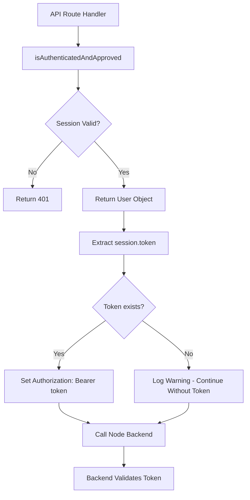

# Migration Plan: Bearer Token Authentication for Node Backend

## Executive Summary

The Node backend has been updated to **only accept** `Authorization: Bearer <token>` for authentication. However, the Next.js frontend proxy routes are still forwarding legacy authentication methods (cookies, `x-session-token`, `x-mobile-token`) to the backend, causing authentication failures.

This plan outlines the migration strategy to update all proxy routes to extract the bearer token from the better-auth session and send it to the Node backend.

---

## Current State Analysis

### Authentication Architecture

**Better-Auth Setup (Frontend):**
- Uses `bearer` plugin (enabled in [`src/lib/auth.ts:147`](src/lib/auth.ts:147))
- Uses `deviceAuthorization` plugin for TV/mobile clients
- Session object includes a `token` field that serves as a JWT bearer token
- Web clients: cookie-based sessions
- Mobile/TV clients: already use `Authorization: Bearer <token>`

**Current Proxy Behavior (Problematic):**
Routes currently forward these headers to Node backend:
- `cookie` (web sessions)
- `x-session-token` (legacy)
- `x-mobile-token` (legacy)
- `authorization` (only from clients already sending it)

**Node Backend Expectation (New):**
- **ONLY** accepts: `Authorization: Bearer <token>`
- Rejects all other authentication methods

### Affected Routes

#### 1. TMDB Proxy Routes
All routes proxy to Node backend's TMDB endpoints:

- [`src/app/api/authenticated/tmdb/[...endpoint]/route.js`](src/app/api/authenticated/tmdb/[...endpoint]/route.js)
  - Lines 59-66: Forwards `authorization`, `x-session-token`, `x-mobile-token`, `cookie`
  - Lines 149-151: POST handler forwards `cookie`
  
- [`src/app/api/authenticated/tmdb/collection/[collectionId]/route.js`](src/app/api/authenticated/tmdb/collection/[collectionId]/route.js)
  - Lines 58-60: Forwards `cookie`
  
- [`src/app/api/authenticated/tmdb/details/[type]/[id]/route.js`](src/app/api/authenticated/tmdb/details/[type]/[id]/route.js)
  - Lines 53-55: Forwards `cookie`
  
- [`src/app/api/authenticated/tmdb/search/route.js`](src/app/api/authenticated/tmdb/search/route.js)
  - Lines 59-61: Forwards `cookie`
  
- [`src/app/api/authenticated/tmdb/health/route.js`](src/app/api/authenticated/tmdb/health/route.js)
  - Lines 78-80: Forwards `cookie`

#### 2. Admin Routes
- [`src/app/api/authenticated/admin/subtitles/save/route.js`](src/app/api/authenticated/admin/subtitles/save/route.js)
  - Lines 66-86: Complex fallback logic with authorization, x-mobile-token, x-session-token, cookie

#### 3. Other Backend-Calling Routes
- [`src/app/api/authenticated/watchlist-content/route.js`](src/app/api/authenticated/watchlist-content/route.js)
  - Lines 101-109: Forwards all auth headers for TMDB authentication
  
- [`src/app/api/authenticated/[...admin]/route.js`](src/app/api/authenticated/[...admin]/route.js)
  - Lines 646: Forwards `cookie`

---

## Solution Design

### Core Strategy

**Unified Bearer Token Approach:**
1. Extract the session token from better-auth's session object
2. Always send `Authorization: Bearer <token>` to Node backend
3. Remove all legacy header forwarding (cookies, x-session-token, x-mobile-token)

### Token Extraction Flow



### Implementation Approach

#### Phase 1: Create Utility Function

Create [`src/utils/backendAuth.js`](src/utils/backendAuth.js) with:

```javascript
/**
 * Generate Authorization header for Node backend requests
 * @param {Request} request - The incoming Next.js request
 * @returns {Object} Headers object with Authorization if available
 */
export async function getBackendAuthHeaders(request) {
  const headers = {
    'Content-Type': 'application/json',
  }
  
  // Try to get Authorization header if client already provided it
  // (e.g., mobile/TV clients using device authorization)
  const authHeader = request.headers.get('authorization')
  if (authHeader && authHeader.startsWith('Bearer ')) {
    headers['Authorization'] = authHeader
    return headers
  }
  
  // For web clients, extract token from session
  // Note: The session is already validated by isAuthenticatedAndApproved
  // We need to get it again here to extract the token
  const session = await getSession()
  
  if (session?.session?.token) {
    headers['Authorization'] = `Bearer ${session.session.token}`
  } else {
    console.warn('No session token available for backend authentication')
  }
  
  return headers
}
```

**Key Characteristics:**
- Checks for existing `Authorization` header first (mobile/TV clients)
- Falls back to extracting token from web session
- Always returns headers object (defensive programming)
- Logs warning if token unavailable (aids debugging)

#### Phase 2: Update Route Handlers

**Pattern to Apply:**

**BEFORE:**
```javascript
const headers = {
  'Content-Type': 'application/json',
}

const authHeadersToForward = ['authorization', 'x-session-token', 'x-mobile-token', 'cookie']
authHeadersToForward.forEach(headerName => {
  const headerValue = request.headers.get(headerName)
  if (headerValue) {
    headers[headerName] = headerValue
  }
})
```

**AFTER:**
```javascript
import { getBackendAuthHeaders } from '@src/utils/backendAuth'

// ... in handler function
const headers = await getBackendAuthHeaders(request)

// Optional: Add other non-auth headers as needed
// headers['X-Custom-Header'] = 'value'
```

---

## Implementation Steps

### Step 1: Create Utility Function ✅
- **File:** `src/utils/backendAuth.js`
- **Purpose:** Centralized bearer token extraction logic
- **Dependencies:** `src/lib/cachedAuth.js` (getSession)

### Step 2: Update TMDB Proxy Routes

#### 2.1 Dynamic Endpoint Handler
**File:** [`src/app/api/authenticated/tmdb/[...endpoint]/route.js`](src/app/api/authenticated/tmdb/[...endpoint]/route.js)

**Changes:**
- **Lines 53-66 (GET handler):** Replace legacy header forwarding with `getBackendAuthHeaders(request)`
- **Lines 143-151 (POST handler):** Replace cookie forwarding with `getBackendAuthHeaders(request)`

**Impact:** All dynamic TMDB endpoints (comprehensive, cast, videos, images, rating, episode)

#### 2.2 Collection Route
**File:** [`src/app/api/authenticated/tmdb/collection/[collectionId]/route.js`](src/app/api/authenticated/tmdb/collection/[collectionId]/route.js)

**Changes:**
- **Lines 52-60:** Replace cookie forwarding with `getBackendAuthHeaders(request)`

#### 2.3 Details Route
**File:** [`src/app/api/authenticated/tmdb/details/[type]/[id]/route.js`](src/app/api/authenticated/tmdb/details/[type]/[id]/route.js)

**Changes:**
- **Lines 47-55:** Replace cookie forwarding with `getBackendAuthHeaders(request)`

#### 2.4 Search Route
**File:** [`src/app/api/authenticated/tmdb/search/route.js`](src/app/api/authenticated/tmdb/search/route.js)

**Changes:**
- **Lines 54-61:** Replace cookie forwarding with `getBackendAuthHeaders(request)`

#### 2.5 Health Route
**File:** [`src/app/api/authenticated/tmdb/health/route.js`](src/app/api/authenticated/tmdb/health/route.js)

**Changes:**
- **Lines 73-80:** Replace cookie forwarding with `getBackendAuthHeaders(request)`

### Step 3: Update Admin Routes

#### 3.1 Subtitles Save Route
**File:** [`src/app/api/authenticated/admin/subtitles/save/route.js`](src/app/api/authenticated/admin/subtitles/save/route.js)

**Changes:**
- **Lines 54-86:** Simplify complex fallback logic to use `getBackendAuthHeaders(request)`
- Remove special handling for `x-mobile-token`, `x-session-token`, cookies

### Step 4: Update Other Routes

#### 4.1 Watchlist Content Route
**File:** [`src/app/api/authenticated/watchlist-content/route.js`](src/app/api/authenticated/watchlist-content/route.js)

**Changes:**
- **Lines 101-109:** Replace multi-header forwarding with `getBackendAuthHeaders(request)`
- Update comment about "authHeaders for TMDB authentication"

#### 4.2 Admin Proxy Route
**File:** [`src/app/api/authenticated/[...admin]/route.js`](src/app/api/authenticated/[...admin]/route.js)

**Changes:**
- **Line 646:** Replace cookie forwarding with `getBackendAuthHeaders(request)`

---

## Testing Strategy

### Test Scenarios

#### 1. Web Client Authentication
**Setup:**
- User logged in via Google/Discord OAuth
- Cookie-based session

**Test Cases:**
- ✅ Access any TMDB proxy endpoint
- ✅ Access admin endpoints (if admin user)
- ✅ Access watchlist content
- ✅ Verify `Authorization: Bearer <token>` is sent to Node backend
- ✅ Verify successful data retrieval

#### 2. Mobile/TV Client Authentication
**Setup:**
- Device authorization flow completed
- Client already sends `Authorization: Bearer <token>`

**Test Cases:**
- ✅ Access TMDB proxy endpoints with existing Bearer token
- ✅ Verify token is forwarded correctly (not replaced)
- ✅ Verify successful data retrieval

#### 3. Edge Cases
- ❌ No session/expired session → Should return 401 from `isAuthenticatedAndApproved`
- ⚠️ Valid session but no token field → Log warning, backend may fail (acceptable degradation)
- ✅ Session token present → Should work normally

### Testing Tools

**Manual Testing:**
1. Browser DevTools Network tab
   - Inspect request headers to Node backend
   - Verify `Authorization: Bearer <token>` present
   
2. Node backend logs
   - Verify authentication successful
   - Check for 401/403 errors

**Automated Testing:**
- Update existing integration tests for TMDB routes
- Add test cases for Bearer token extraction
- Mock better-auth session with token field

---

## Migration Checklist

### Pre-Migration
- [x] Analyze current authentication flow
- [x] Identify all affected routes
- [x] Design Bearer token extraction strategy
- [x] Document migration plan

### Implementation
- [ ] Create `src/utils/backendAuth.js` utility function
- [ ] Update TMDB proxy routes (6 files)
  - [ ] `[...endpoint]/route.js` (GET + POST)
  - [ ] `collection/[collectionId]/route.js`
  - [ ] `details/[type]/[id]/route.js`
  - [ ] `search/route.js`
  - [ ] `health/route.js`
- [ ] Update admin routes
  - [ ] `admin/subtitles/save/route.js`
  - [ ] `[...admin]/route.js`
- [ ] Update other routes
  - [ ] `watchlist-content/route.js`

### Testing & Validation
- [ ] Test web client authentication (OAuth users)
- [ ] Test mobile/TV client authentication (device auth)
- [ ] Test admin routes
- [ ] Verify no regression in existing functionality
- [ ] Check Node backend logs for successful authentication

### Deployment
- [ ] Deploy to staging environment
- [ ] Smoke test all critical paths
- [ ] Monitor error logs for authentication issues
- [ ] Deploy to production
- [ ] Post-deployment monitoring

---

## Rollback Strategy

If issues are discovered post-deployment:

### Quick Rollback
1. Revert route handlers to forward legacy headers
2. Update Node backend to accept both Bearer tokens AND legacy methods temporarily

### Code Rollback
```bash
git revert <commit-hash>
git push origin main
```

### Monitoring Points
- HTTP 401/403 error rate increase
- Backend authentication failure logs
- User reports of "not authorized" errors

---

## Benefits of Migration

### Security ✅
- **Standardized authentication:** Industry-standard Bearer token approach
- **Reduced complexity:** Single authentication method simplifies security audits
- **Better token management:** Centralized token extraction logic

### Maintainability ✅
- **DRY principle:** Utility function eliminates code duplication across 10+ routes
- **Easier debugging:** Single point of failure for token extraction
- **Future-proof:** Aligns with modern authentication patterns

### Performance ⚡
- **Minimal impact:** No additional overhead beyond session lookup (already cached)
- **Cleaner headers:** Fewer headers sent to backend reduces payload size

---

## Alternative Approaches Considered

### Alternative 1: Backend Accepts Both Methods ❌
**Rejected because:**
- Increases Node backend complexity
- Maintains technical debt
- Security risk of supporting multiple auth methods

### Alternative 2: Client-Side Token Injection ❌
**Rejected because:**
- Requires changes to all fetch calls across the app
- Higher risk of breaking existing functionality
- Not feasible for SSR/server components

### Alternative 3: Middleware-Based Token Injection ❌
**Rejected because:**
- Next.js middleware cannot modify request bodies easily
- Adds complexity to request pipeline
- Server-side route approach is more explicit and debuggable

---

## Session Token Availability

### Better-Auth Session Structure

According to better-auth documentation and our configuration:

```typescript
type Session = {
  session: {
    token: string      // JWT bearer token ✅
    userId: string
    expiresAt: Date
    // ... other fields
  }
  user: {
    id: string
    email: string
    // ... other fields
  }
}
```

### Token Generation

The `bearer` plugin automatically:
1. Generates a JWT token when session is created
2. Includes token in session object
3. Validates token when `Authorization: Bearer <token>` is received

**Configuration:** [`src/lib/auth.ts:147`](src/lib/auth.ts:147)
```typescript
plugins: [
  bearer(),  // Enables Bearer token support
  // ...
]
```

### Token Usage Patterns

**Web Clients (Cookie Sessions):**
- Session stored in httpOnly cookie
- Token field available in session object
- Frontend extracts token server-side for backend calls

**Mobile/TV Clients (Device Authorization):**
- Session token returned from device authorization flow
- Client stores token and sends as `Authorization: Bearer <token>`
- Frontend forwards existing header

---

## Implementation Timeline

**Estimated Time:** 4-6 hours

| Phase | Task | Duration | Dependencies |
|-------|------|----------|--------------|
| 1 | Create utility function | 30 min | - |
| 2 | Update TMDB routes | 1.5 hours | Phase 1 |
| 3 | Update admin routes | 1 hour | Phase 1 |
| 4 | Update other routes | 30 min | Phase 1 |
| 5 | Testing (web clients) | 1 hour | Phases 2-4 |
| 6 | Testing (mobile/TV) | 30 min | Phases 2-4 |
| 7 | Documentation | 30 min | All phases |

**Total:** ~5.5 hours

---

## Questions & Answers

### Q: Will this break existing mobile/TV clients?
**A:** No. The utility function checks for existing `Authorization` header first and preserves it.

### Q: What if session.token is undefined/null?
**A:** The utility function logs a warning and returns headers without Authorization. The backend will return 401, which is the correct behavior for unauthenticated requests.

### Q: Do we need to update client-side fetch calls?
**A:** No. All changes are server-side in Next.js API route handlers. Client-side code remains unchanged.

### Q: How does this affect caching?
**A:** No impact. The routes already use `httpGet` with caching strategies. Only the headers change.

### Q: What about webhook authentication?
**A:** Webhooks use `X-Webhook-ID` header, which is separate from session-based auth. No changes needed.

---

## References

### Documentation
- [Better-Auth Bearer Plugin](https://better-auth.com/docs/plugins/bearer)
- [Better-Auth Device Authorization](https://better-auth.com/docs/plugins/device-authorization)
- [Next.js API Routes](https://nextjs.org/docs/app/building-your-application/routing/route-handlers)

### Related Files
- [`src/lib/auth.ts`](src/lib/auth.ts) - Better-auth configuration
- [`src/lib/cachedAuth.js`](src/lib/cachedAuth.js) - Cached session retrieval
- [`src/utils/routeAuth.js`](src/utils/routeAuth.js) - Authentication utilities
- [`src/lib/httpHelper.js`](src/lib/httpHelper.js) - HTTP client with retry/caching

---

## Appendix: Code Snippets

### Utility Function Template

```javascript
// src/utils/backendAuth.js
import { getSession } from '@src/lib/cachedAuth'

/**
 * Generate Authorization header for Node backend requests.
 * 
 * Strategy:
 * 1. Check if client already provided Authorization: Bearer <token> (mobile/TV)
 * 2. Extract token from better-auth session (web clients)
 * 3. Return headers object with Authorization if available
 * 
 * @param {Request} request - The incoming Next.js request
 * @returns {Promise<Object>} Headers object with Authorization
 */
export async function getBackendAuthHeaders(request) {
  const headers = {
    'Content-Type': 'application/json',
  }
  
  // Priority 1: Use existing Authorization header (mobile/TV clients)
  const authHeader = request.headers.get('authorization')
  if (authHeader && authHeader.startsWith('Bearer ')) {
    headers['Authorization'] = authHeader
    return headers
  }
  
  // Priority 2: Extract token from session (web clients)
  try {
    const session = await getSession()
    
    if (session?.session?.token) {
      headers['Authorization'] = `Bearer ${session.session.token}`
    } else {
      console.warn('[backendAuth] No session token available for backend authentication')
    }
  } catch (error) {
    console.error('[backendAuth] Error getting session:', error)
  }
  
  return headers
}
```

### Example Route Update

**Before:**
```javascript
const headers = {
  'Content-Type': 'application/json',
}

if (request.headers.get('cookie')) {
  headers['cookie'] = request.headers.get('cookie')
}

const response = await httpGet(backendUrl, { headers, ... })
```

**After:**
```javascript
import { getBackendAuthHeaders } from '@src/utils/backendAuth'

const headers = await getBackendAuthHeaders(request)

const response = await httpGet(backendUrl, { headers, ... })
```

---

**End of Migration Plan**
