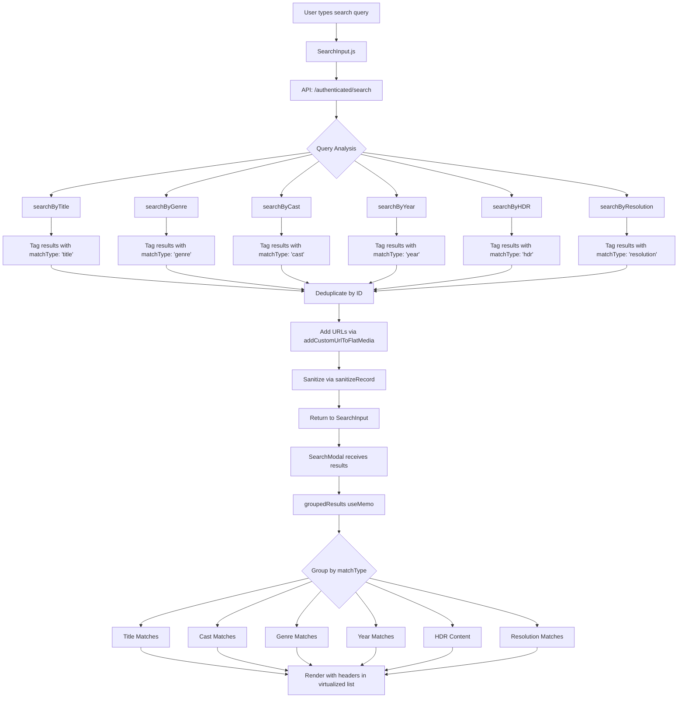

# Search Enhancement Plan

## Overview
Enhance the search functionality in [`SearchModal.js`](../src/components/Search/SearchModal.js) to allow users to search by:
- **Media title** (already exists)
- **Genre**
- **Cast**
- **Release date/year**
- **HDR**
- **Resolution** (4K, 1080p, etc.)

Results will be **visually grouped** by match type to improve user experience.

---

## Data Structure Analysis

Based on the provided MongoDB document structure:

```javascript
{
  title: "Airheads",
  type: "movie",
  metadata: {
    cast: [
      { name: "Brendan Fraser", character: "Chester 'Chazz' Darvey", ... },
      { name: "Steve Buscemi", character: "Rex", ... }
    ],
    genres: [
      { id: 35, name: "Comedy" },
      { id: 80, name: "Crime" }
    ],
    release_date: { "$date": "1994-08-05T00:00:00.000Z" }
  },
  dimensions: "1920x1080",
  mediaQuality: {
    isHDR: false,
    viewingExperience: { highDynamicRange: false, ... }
  }
}
```

---

## Implementation Plan

### Phase 1: Backend - Data Projections
**File**: [`src/utils/auth_utils.js`](../src/utils/auth_utils.js)

#### 1.1 Update `movieProjectionFields` (Lines 6-24)
Add missing fields to ensure they're fetched from database:
```javascript
export const movieProjectionFields = {
  _id: 1,
  mediaLastModified: 1,
  posterURL: 1,
  posterBlurhash: 1,
  backdrop: 1,
  backdropBlurhash: 1,
  title: 1,
  dimensions: 1,                    // ✅ Already exists
  posterBlurhashSource: 1,
  backdropBlurhashSource: 1,
  hdr: 1,                           // ✅ Already exists
  mediaQuality: 1,                  // ➕ ADD THIS
  'metadata.id': 1,
  'metadata.overview': 1,
  'metadata.release_date': 1,      // ✅ Already exists
  'metadata.genres': 1,            // ✅ Already exists
  'metadata.cast': 1,              // ➕ ADD THIS
  'metadata.poster_path': 1,
  'metadata.trailer_url': 1,
}
```

#### 1.2 Update `tvShowProjectionFields` (Lines 26-45)
Add missing fields:
```javascript
export const tvShowProjectionFields = {
  _id: 1,
  posterURL: 1,
  posterBlurhash: 1,
  backdrop: 1,
  backdropBlurhash: 1,
  title: 1,
  posterSource: 1,
  posterBlurhashSource: 1,
  backdropBlurhashSource: 1,
  dimensions: 1,                    // ➕ ADD THIS
  mediaQuality: 1,                  // ➕ ADD THIS
  'metadata.id': 1,
  'metadata.overview': 1,
  'metadata.last_air_date': 1,
  'metadata.first_air_date': 1,    // ➕ ADD THIS
  'metadata.networks': 1,
  'metadata.genres': 1,            // ✅ Already exists
  'metadata.cast': 1,              // ➕ ADD THIS
  'metadata.status': 1,
  'metadata.poster_path': 1,
  'metadata.trailer_url': 1,
  seasons: 1,
}
```

#### 1.3 Update `sanitizeRecord` Function (Lines 414-578)
Ensure `dimensions` and `hdr` are included in the returned object:

**For TV shows (Lines 496-527):**
```javascript
result = {
  id: record.id,
  normalizedVideoId: record.episode.normalizedVideoId,
  ...dateValues,
  link: `${record.title}/${record.seasonNumber}/${record.episode.episodeNumber}`,
  duration: record.duration ?? record.episode.duration ?? 0,
  posterURL: poster,
  posterBlurhash: record.posterBlurhash || null,
  backdrop: record.backdrop || getFullImageUrl(record.metadata?.backdrop_path) || null,
  backdropBlurhash: record.backdropBlurhash || null,
  title: mainTitle || null,
  showTitleFormatted: record.showTitleFormatted || null,
  showId: record.showId || null,
  showTmdbId: record.showTmdbId || null,
  logo: record.logo || getFullImageUrl(record.metadata?.logo_path) || null,
  type: type,
  metadata: record.metadata || null,
  hdr: record.hdr || record.mediaQuality?.isHDR || null,      // ➕ ADD fallback
  dimensions: record.dimensions || null,                        // ➕ ADD THIS
  seasons: record.seasons,
  // Add season/episode data at top level for UI components
  seasonNumber: record.seasonNumber ?? record.episode.seasonNumber,
  episodeNumber: record.episode.episodeNumber,
  videoSource: record.videoSource || record.episode.videoSource || null,
  thumbnail: record.episode.thumbnail,
  thumbnailBlurhash: record.episode.thumbnailBlurhash || null,
  deviceInfo: deviceInfo,
}
```

**For movies (Lines 534-551):**
```javascript
result = {
  id: record.id,
  normalizedVideoId: record.normalizedVideoId,
  ...dateValues,
  link: encodeURIComponent(record.title),
  duration: record.duration ?? 0,
  posterURL: poster,
  posterBlurhash: record.posterBlurhash || null,
  backdrop: record.backdrop || getFullImageUrl(record.metadata?.backdrop_path) || null,
  backdropBlurhash: record.backdropBlurhash || null,
  title: record.title || record.metadata?.title || null,
  type: type,
  metadata: record.metadata || null,
  hdr: record.hdr || record.mediaQuality?.isHDR || null,      // ➕ ADD fallback
  dimensions: record.dimensions || null,                        // ➕ ADD THIS
  deviceInfo: deviceInfo,
}
```

---

### Phase 2: Backend - Search Logic
**File**: [`src/app/api/authenticated/search/route.js`](../src/app/api/authenticated/search/route.js)

#### 2.1 Current Implementation (Lines 44-67)
Currently only searches by title:
```javascript
async function searchMedia(query) {
  const client = await clientPromise
  const db = client.db('Media')
  
  if (query) {
    [movies, tvShows] = await Promise.all([
      db.collection('FlatMovies')
        .find({ title: { $regex: query, $options: 'i' } })
        .toArray(),
      db.collection('FlatTVShows')
        .find({ title: { $regex: query, $options: 'i' } })
        .toArray(),
    ])
  }
  // ... rest of function
}
```

#### 2.2 Enhanced Implementation
Replace `searchMedia` function with advanced multi-criteria search:

```javascript
async function searchMedia(query) {
  const client = await clientPromise
  const db = client.db('Media')
  let recentlyAddedMediaQuery = false

  if (!query) {
    const recentlyAddedMedia = await getFlatRecentlyAddedMedia({ limit: 15 })
    return recentlyAddedMedia
  }

  // Build search criteria based on query
  const searchCriteria = buildSearchCriteria(query)
  
  // Execute searches for each match type
  const [
    titleMatches,
    genreMatches,
    castMatches,
    yearMatches,
    hdrMatches,
    resolutionMatches
  ] = await Promise.all([
    searchByTitle(db, query),
    searchByGenre(db, query),
    searchByCast(db, query),
    searchByYear(db, query),
    searchByHDR(db, query),
    searchByResolution(db, query)
  ])

  // Tag each result with its matchType
  const taggedResults = [
    ...titleMatches.map(r => ({ ...r, matchType: 'title' })),
    ...genreMatches.map(r => ({ ...r, matchType: 'genre' })),
    ...castMatches.map(r => ({ ...r, matchType: 'cast' })),
    ...yearMatches.map(r => ({ ...r, matchType: 'year' })),
    ...hdrMatches.map(r => ({ ...r, matchType: 'hdr' })),
    ...resolutionMatches.map(r => ({ ...r, matchType: 'resolution' }))
  ]

  // Remove duplicates while preserving the best matchType
  const deduplicatedResults = deduplicateResults(taggedResults)
  
  // Add URLs and sanitize
  const [moviesWithUrl, tvShowsWithUrl] = await Promise.all([
    addCustomUrlToFlatMedia(
      deduplicatedResults.filter(r => r.type === 'movie'),
      'movie'
    ),
    addCustomUrlToFlatMedia(
      deduplicatedResults.filter(r => r.type === 'tv'),
      'tv'
    ),
  ])

  const sanitizedResults = await Promise.all(
    [...moviesWithUrl, ...tvShowsWithUrl].map(item => 
      sanitizeRecord(item, item.type)
    )
  )

  return sanitizedResults.filter(Boolean)
}
```

#### 2.3 Helper Functions to Add

```javascript
// Detect what type of search the user is performing
function buildSearchCriteria(query) {
  const trimmed = query.trim()
  
  return {
    isYear: /^\d{4}$/.test(trimmed),  // "1994"
    isHDR: /^hdr$/i.test(trimmed),     // "HDR"
    is4K: /^4k$/i.test(trimmed),       // "4K"
    is1080p: /^1080p?$/i.test(trimmed), // "1080p" or "1080"
    original: query
  }
}

// Search by title (existing functionality)
async function searchByTitle(db, query) {
  const [movies, tvShows] = await Promise.all([
    db.collection('FlatMovies')
      .find({ title: { $regex: query, $options: 'i' } }, { projection: movieProjectionFields })
      .toArray(),
    db.collection('FlatTVShows')
      .find({ title: { $regex: query, $options: 'i' } }, { projection: tvShowProjectionFields })
      .toArray(),
  ])
  return [...movies, ...tvShows]
}

// Search by genre
async function searchByGenre(db, query) {
  const [movies, tvShows] = await Promise.all([
    db.collection('FlatMovies')
      .find({ 'metadata.genres.name': { $regex: query, $options: 'i' } }, { projection: movieProjectionFields })
      .toArray(),
    db.collection('FlatTVShows')
      .find({ 'metadata.genres.name': { $regex: query, $options: 'i' } }, { projection: tvShowProjectionFields })
      .toArray(),
  ])
  return [...movies, ...tvShows]
}

// Search by cast
async function searchByCast(db, query) {
  const [movies, tvShows] = await Promise.all([
    db.collection('FlatMovies')
      .find({ 'metadata.cast.name': { $regex: query, $options: 'i' } }, { projection: movieProjectionFields })
      .toArray(),
    db.collection('FlatTVShows')
      .find({ 'metadata.cast.name': { $regex: query, $options: 'i' } }, { projection: tvShowProjectionFields })
      .toArray(),
  ])
  return [...movies, ...tvShows]
}

// Search by year
async function searchByYear(db, query) {
  if (!/^\d{4}$/.test(query.trim())) return []
  
  const year = parseInt(query.trim())
  const startDate = new Date(year, 0, 1)
  const endDate = new Date(year + 1, 0, 1)
  
  const [movies, tvShows] = await Promise.all([
    db.collection('FlatMovies')
      .find({
        'metadata.release_date': {
          $gte: startDate,
          $lt: endDate
        }
      }, { projection: movieProjectionFields })
      .toArray(),
    db.collection('FlatTVShows')
      .find({
        'metadata.first_air_date': {
          $gte: startDate,
          $lt: endDate
        }
      }, { projection: tvShowProjectionFields })
      .toArray(),
  ])
  return [...movies, ...tvShows]
}

// Search by HDR
async function searchByHDR(db, query) {
  if (!/^hdr$/i.test(query.trim())) return []
  
  const [movies, tvShows] = await Promise.all([
    db.collection('FlatMovies')
      .find({
        $or: [
          { hdr: { $exists: true, $ne: false, $ne: null } },
          { 'mediaQuality.isHDR': true }
        ]
      }, { projection: movieProjectionFields })
      .toArray(),
    db.collection('FlatTVShows')
      .find({
        $or: [
          { hdr: { $exists: true, $ne: false, $ne: null } },
          { 'mediaQuality.isHDR': true }
        ]
      }, { projection: tvShowProjectionFields })
      .toArray(),
  ])
  return [...movies, ...tvShows]
}

// Search by resolution
async function searchByResolution(db, query) {
  const trimmed = query.trim().toLowerCase()
  let dimensionPattern = null
  
  if (trimmed === '4k') {
    dimensionPattern = /^(3840|4096)/ // 4K UHD or DCI 4K
  } else if (trimmed === '1080p' || trimmed === '1080') {
    dimensionPattern = /^1920x1080/
  } else if (trimmed === '720p' || trimmed === '720') {
    dimensionPattern = /^1280x720/
  } else {
    return []
  }
  
  const [movies, tvShows] = await Promise.all([
    db.collection('FlatMovies')
      .find({ dimensions: { $regex: dimensionPattern } }, { projection: movieProjectionFields })
      .toArray(),
    db.collection('FlatTVShows')
      .find({ dimensions: { $regex: dimensionPattern } }, { projection: tvShowProjectionFields })
      .toArray(),
  ])
  return [...movies, ...tvShows]
}

// Remove duplicates, keeping the best matchType
function deduplicateResults(results) {
  const seen = new Map()
  const matchTypePriority = { title: 1, cast: 2, genre: 3, year: 4, hdr: 5, resolution: 6 }
  
  for (const result of results) {
    const key = result._id.toString()
    const existing = seen.get(key)
    
    if (!existing || matchTypePriority[result.matchType] < matchTypePriority[existing.matchType]) {
      seen.set(key, result)
    }
  }
  
  return Array.from(seen.values())
}
```

---

### Phase 3: Frontend - Grouped Display
**File**: [`src/components/Search/SearchModal.js`](../src/components/Search/SearchModal.js)

#### 3.1 Current Implementation
Currently uses HeadlessUI's virtualization to display a flat list:
```javascript
<ComboboxOptions virtual={{ options: displayData }}>
  {({ option: media }) => (
    <ComboboxOption value={media} ...>
      {/* Media item */}
    </ComboboxOption>
  )}
</ComboboxOptions>
```

#### 3.2 Enhanced Implementation

**Step 1**: Transform flat results into grouped structure in `useMemo`:
```javascript
// Add after line 65
const groupedResults = useMemo(() => {
  if (!query || displayData.length === 0) return displayData
  
  // Group by matchType
  const groups = displayData.reduce((acc, item) => {
    const matchType = item.matchType || 'title'
    if (!acc[matchType]) acc[matchType] = []
    acc[matchType].push(item)
    return acc
  }, {})
  
  // Define order and labels for groups
  const groupOrder = [
    { key: 'title', label: 'Title Matches' },
    { key: 'cast', label: 'Cast Matches' },
    { key: 'genre', label: 'Genre Matches' },
    { key: 'year', label: 'Year Matches' },
    { key: 'hdr', label: 'HDR Content' },
    { key: 'resolution', label: 'Resolution Matches' }
  ]
  
  // Flatten with headers
  const flattened = []
  for (const { key, label } of groupOrder) {
    if (groups[key] && groups[key].length > 0) {
      flattened.push({ type: 'header', label, key })
      flattened.push(...groups[key].map(item => ({ type: 'item', data: item })))
    }
  }
  
  return flattened
}, [displayData, query])
```

**Step 2**: Update virtualization to use grouped data:
```javascript
<Combobox virtual={{ options: groupedResults }}>
  {({ option }) => {
    if (option.type === 'header') {
      // Render group header
      return (
        <div className="px-6 py-2 text-xs font-semibold text-gray-500 bg-gray-50 sticky top-0">
          {option.label}
        </div>
      )
    }
    
    // Render media item
    const media = option.data
    return (
      <ComboboxOption
        value={media}
        className="-mx-2 flex cursor-default select-none items-center rounded-md p-2 h-16 data-[focus]:bg-gray-100 data-[focus]:text-gray-900 w-full max-w-full"
      >
        {/* Existing media item rendering */}
      </ComboboxOption>
    )
  }}
</Combobox>
```

**Step 3**: Update activeOption handling to skip headers:
```javascript
{activeOption && activeOption.type !== 'header' && (
  <div className="space-y-3" key={activeOption.data?.id || activeOption.data?.url}>
    <MediaPoster
      movie={activeOption.data}
      // ... props
    />
  </div>
)}
```

---

## Implementation Checklist

### Backend Changes
- [ ] Update [`movieProjectionFields`](../src/utils/auth_utils.js#L6-L24) to include `mediaQuality` and `metadata.cast`
- [ ] Update [`tvShowProjectionFields`](../src/utils/auth_utils.js#L26-L45) to include `dimensions`, `mediaQuality`, `metadata.cast`, and `metadata.first_air_date`
- [ ] Update [`sanitizeRecord`](../src/utils/auth_utils.js#L414-L578) to include `dimensions` and `hdr` fallback for both TV and movies
- [ ] Rewrite [`searchMedia`](../src/app/api/authenticated/search/route.js#L44-L67) function with multi-criteria search
- [ ] Add helper functions: `buildSearchCriteria`, `searchByTitle`, `searchByGenre`, `searchByCast`, `searchByYear`, `searchByHDR`, `searchByResolution`, `deduplicateResults`
- [ ] Add `matchType` property to all search results

### Frontend Changes
- [ ] Add [`groupedResults`](../src/components/Search/SearchModal.js) `useMemo` to transform flat results
- [ ] Update virtualized list to render headers and items
- [ ] Update `activeOption` handling to skip headers
- [ ] Test header rendering and sticky positioning
- [ ] Verify 4K/HDR badges display correctly using `dimensions` and `hdr` fields

---

## Testing Strategy

1. **Title Search**: Search "Airheads" → Should show under "Title Matches"
2. **Genre Search**: Search "Comedy" → Should show all comedies under "Genre Matches"
3. **Cast Search**: Search "Brendan Fraser" → Should show his films under "Cast Matches"
4. **Year Search**: Search "1994" → Should show 1994 releases under "Year Matches"
5. **HDR Search**: Search "HDR" → Should show HDR content under "HDR Content"
6. **Resolution Search**: Search "4K" or "1080p" → Should show matching resolutions
7. **Multiple Matches**: Search "Adam" → Should show under both "Title Matches" (if title contains Adam) and "Cast Matches" (Adam Sandler)
8. **Deduplication**: Verify movies appear only once with the best matchType
9. **Empty State**: Verify "Nothing found" message appears for no results
10. **Recent Additions**: Verify recent additions still show when query is empty

---

## Data Flow Diagram



---

## Notes & Edge Cases

1. **Performance**: Each search type runs in parallel using `Promise.all` for optimal speed
2. **Deduplication Priority**: Title matches are prioritized highest, then cast, genre, year, HDR, resolution
3. **Case Sensitivity**: All regex searches use `$options: 'i'` for case-insensitive matching
4. **Year Detection**: Only 4-digit numbers are treated as years (e.g., "1994", "2024")
5. **Resolution Patterns**: 
   - "4K" matches `3840x` or `4096x`
   - "1080p" matches `1920x1080`
   - "720p" matches `1280x720`
6. **HDR Detection**: Checks both `hdr` field and `mediaQuality.isHDR` for maximum compatibility
7. **Empty Headers**: Headers only render if their group has results
8. **Virtualization**: Headers are part of the virtualized list for optimal performance with large result sets
9. **Sticky Headers**: Use `sticky top-0` to keep headers visible while scrolling groups
10. **Active Option**: Must skip headers when displaying the preview pane on the right

---

## Future Enhancements

1. **Multi-word Queries**: Split queries like "Adam Sandler 1994" to search multiple criteria
2. **Advanced Filters**: Add UI controls for explicit genre/cast/year selection
3. **Search History**: Remember recent searches
4. **Autocomplete**: Suggest cast names, genres, years as user types
5. **Sorting**: Allow sorting within groups (e.g., by release date)
6. **Export Results**: Allow exporting search results
