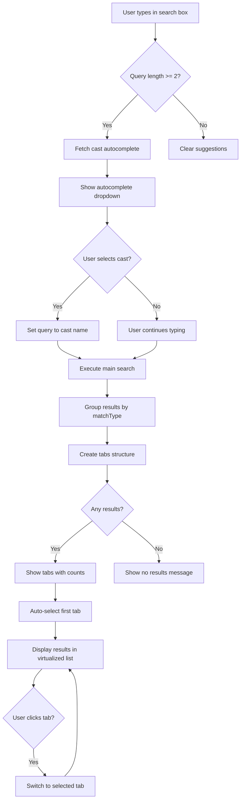

# Search Tabs & Cast Autocomplete Enhancement Plan

## Overview
Transform the search modal from grouped headers to a **tabbed interface** with **cast name autocomplete** for better user experience and discoverability.

## Part 1: Tab-Based Search UI

### Benefits
✅ **Cleaner Organization**: Each result type gets its own dedicated space  
✅ **Quick Navigation**: Users can easily switch between result types  
✅ **Visual Feedback**: Tab badges show count of results per category  
✅ **Auto-Selection**: First tab with results is automatically selected  
✅ **Touch-Friendly**: Better for mobile/tablet navigation  
✅ **Reduced Scroll**: Users don't need to scroll through irrelevant results  

### UI Mockup

```
┌─────────────────────────────────────────────────────────────┐
│  🔍 Search...                                           ✕   │
├─────────────────────────────────────────────────────────────┤
│                                                             │
│  ┌─All (15)─┬─Title (3)─┬─Cast (8)─┬─Genre (2)─┬─HDR (2)┐  │
│  │          │           │          │           │         │  │
│  │  [Results displayed in virtualized list]              │  │
│  │                                                        │  │
│  │  • Item 1                                             │  │
│  │  • Item 2                                             │  │
│  │  • Item 3                                             │  │
│  │  • ...                                                │  │
│  │                                                        │  │
│  └────────────────────────────────────────────────────────┘  │
│                                                             │
│  [Preview Panel]                                            │
│                                                             │
└─────────────────────────────────────────────────────────────┘
```

### Implementation Strategy

#### 1. Use HeadlessUI v2 Tab Component

```javascript
import { Tab, TabGroup, TabList, TabPanel, TabPanels } from '@headlessui/react'

const SearchModal = ({ ... }) => {
  // Create tabs structure from grouped results
  const searchTabs = useMemo(() => {
    if (!query) {
      return [{ key: 'all', label: 'Recent', items: recentlyAddedMedia }]
    }
    
    // Group results by matchType
    const groups = {
      all: searchResults,
      title: searchResults.filter(r => r.matchType === 'title'),
      cast: searchResults.filter(r => r.matchType === 'cast'),
      genre: searchResults.filter(r => r.matchType === 'genre'),
      year: searchResults.filter(r => r.matchType === 'year'),
      hdr: searchResults.filter(r => r.matchType === 'hdr'),
      resolution: searchResults.filter(r => r.matchType === 'resolution')
    }
    
    // Only include tabs with results
    const tabs = [
      { key: 'all', label: 'All', items: groups.all },
      { key: 'title', label: 'Title', items: groups.title },
      { key: 'cast', label: 'Cast', items: groups.cast },
      { key: 'genre', label: 'Genre', items: groups.genre },
      { key: 'year', label: 'Year', items: groups.year },
      { key: 'hdr', label: 'HDR', items: groups.hdr },
      { key: 'resolution', label: 'Resolution', items: groups.resolution }
    ].filter(tab => tab.items.length > 0)
    
    return tabs
  }, [query, searchResults, recentlyAddedMedia])
  
  return (
    <TabGroup>
      <TabList className="flex space-x-1 border-b border-gray-200 px-6">
        {searchTabs.map(tab => (
          <Tab
            key={tab.key}
            className={({ selected }) =>
              classNames(
                'px-4 py-2 text-sm font-medium focus:outline-none',
                selected
                  ? 'border-b-2 border-indigo-600 text-indigo-600'
                  : 'text-gray-500 hover:text-gray-700'
              )
            }
          >
            {tab.label}
            <span className="ml-2 px-2 py-0.5 rounded-full bg-gray-100 text-xs">
              {tab.items.length}
            </span>
          </Tab>
        ))}
      </TabList>
      
      <TabPanels>
        {searchTabs.map(tab => (
          <TabPanel key={tab.key}>
            <Combobox virtual={{ options: tab.items }}>
              {/* Existing media item rendering */}
            </Combobox>
          </TabPanel>
        ))}
      </TabPanels>
    </TabGroup>
  )
}
```

---

## Part 2: Cast Autocomplete Feature

### User Flow

1. **User types partial name**: "brend"
2. **Autocomplete dropdown appears**: Shows matching cast names
   ```
   🔍 brend
   ───────────────
   Brendan Fraser (12 titles)
   Brendan Gleeson (8 titles)
   ```
3. **User selects**: "Brendan Fraser"
4. **Search executes**: Shows all media with Brendan Fraser
5. **Tab switches**: Auto-switches to "Cast" tab

### Backend: Cast Autocomplete API

**New File**: `src/app/api/authenticated/cast/autocomplete/route.js`

```javascript
import clientPromise from '@src/lib/mongodb'
import { isAuthenticatedEither } from '@src/utils/routeAuth'

export const POST = async (req) => {
  const authResult = await isAuthenticatedEither(req)
  if (authResult instanceof Response) {
    return authResult
  }

  try {
    const { query } = await req.json()
    
    if (!query || query.length < 2) {
      return new Response(JSON.stringify({ suggestions: [] }), {
        status: 200,
        headers: { 'Content-Type': 'application/json' },
      })
    }

    const suggestions = await getCAstSuggestions(query)
    
    return new Response(JSON.stringify({ suggestions }), {
      status: 200,
      headers: { 'Content-Type': 'application/json' },
    })
  } catch (error) {
    console.error('Error fetching cast suggestions:', error)
    return new Response(JSON.stringify({ error: 'Internal Server Error' }), {
      status: 500,
      headers: { 'Content-Type': 'application/json' },
    })
  }
}

async function getCastSuggestions(query) {
  const client = await clientPromise
  const db = client.db('Media')
  
  // Aggregate to get unique cast names with counts
  const [movieCast, tvCast] = await Promise.all([
    db.collection('FlatMovies').aggregate([
      {
        $match: {
          'metadata.cast.name': { $regex: query, $options: 'i' }
        }
      },
      { $unwind: '$metadata.cast' },
      {
        $match: {
          'metadata.cast.name': { $regex: query, $options: 'i' }
        }
      },
      {
        $group: {
          _id: '$metadata.cast.name',
          count: { $sum: 1 },
          profile_path: { $first: '$metadata.cast.profile_path' }
        }
      },
      { $sort: { count: -1 } },
      { $limit: 10 }
    ]).toArray(),
    
    db.collection('FlatTVShows').aggregate([
      {
        $match: {
          'metadata.cast.name': { $regex: query, $options: 'i' }
        }
      },
      { $unwind: '$metadata.cast' },
      {
        $match: {
          'metadata.cast.name': { $regex: query, $options: 'i' }
        }
      },
      {
        $group: {
          _id: '$metadata.cast.name',
          count: { $sum: 1 },
          profile_path: { $first: '$metadata.cast.profile_path' }
        }
      },
      { $sort: { count: -1 } },
      { $limit: 10 }
    ]).toArray()
  ])
  
  // Merge and deduplicate
  const allCast = [...movieCast, ...tvCast]
  const uniqueCast = new Map()
  
  for (const cast of allCast) {
    const existing = uniqueCast.get(cast._id)
    if (!existing || cast.count > existing.count) {
      uniqueCast.set(cast._id, {
        name: cast._id,
        count: existing ? existing.count + cast.count : cast.count,
        profile_path: cast.profile_path
      })
    }
  }
  
  // Sort by count and return top 10
  return Array.from(uniqueCast.values())
    .sort((a, b) => b.count - a.count)
    .slice(0, 10)
}
```

### Frontend: Cast Autocomplete Component

**Update**: [`src/components/Search/SearchModal.js`](src/components/Search/SearchModal.js)

```javascript
const [castSuggestions, setCastSuggestions] = useState([])
const [showCastSuggestions, setShowCastSuggestions] = useState(false)
const [selectedTab, setSelectedTab] = useState(0)

// Fetch cast suggestions when query changes
const fetchCastSuggestions = useCallback(
  debounce(async (searchQuery) => {
    if (searchQuery.length < 2) {
      setCastSuggestions([])
      return
    }
    
    try {
      const response = await fetch('/api/authenticated/cast/autocomplete', {
        method: 'POST',
        body: JSON.stringify({ query: searchQuery }),
        headers: { 'Content-Type': 'application/json' },
      })
      
      const data = await response.json()
      setCastSuggestions(data.suggestions || [])
      setShowCastSuggestions(data.suggestions.length > 0)
    } catch (error) {
      console.error('Error fetching cast suggestions:', error)
    }
  }, 300),
  []
)

useEffect(() => {
  fetchCastSuggestions(query)
}, [query, fetchCastSuggestions])

// Handle cast selection from autocomplete
const handleCastSelect = useCallback((castName) => {
  setQuery(castName)
  setShowCastSuggestions(false)
  
  // Auto-switch to Cast tab after search completes
  setTimeout(() => {
    const castTabIndex = searchTabs.findIndex(t => t.key === 'cast')
    if (castTabIndex !== -1) {
      setSelectedTab(castTabIndex)
    }
  }, 100)
}, [searchTabs])
```

**Autocomplete Dropdown UI**:

```javascript
{/* Search input with autocomplete */}
<div className="relative border-b border-gray-100">
  <MagnifyingGlassIcon
    className="pointer-events-none absolute left-4 top-3.5 h-5 w-5 text-gray-400"
    aria-hidden="true"
  />
  <ComboboxInput
    className="h-12 w-full border-0 bg-transparent pl-11 pr-4 text-gray-900 placeholder:text-gray-400 focus:ring-0 sm:text-sm"
    placeholder="Search by title, cast, genre, year, HDR, or resolution..."
    id={searchInputId}
    value={query}
    onChange={(event) => setQuery(event.target.value)}
  />
  <XMarkIcon
    className="p-1.5 rounded-full absolute right-4 top-[0.55rem] h-[2.05rem] w-[2.05rem] text-gray-400 hover:text-gray-500 focus:text-gray-500 cursor-pointer"
    onClick={handleClose}
  />
  
  {/* Cast Autocomplete Dropdown */}
  {showCastSuggestions && castSuggestions.length > 0 && (
    <div className="absolute top-full left-0 right-0 bg-white border border-gray-200 rounded-b-lg shadow-lg z-30 max-h-64 overflow-y-auto">
      <div className="px-4 py-2 text-xs font-semibold text-gray-500 border-b border-gray-100">
        Cast Suggestions
      </div>
      {castSuggestions.map((cast) => (
        <button
          key={cast.name}
          className="w-full px-4 py-2 text-left hover:bg-gray-50 focus:bg-gray-50 focus:outline-none flex items-center gap-3"
          onClick={() => handleCastSelect(cast.name)}
        >
          {cast.profile_path && (
            
          )}
          <div className="flex-1">
            <div className="text-sm font-medium text-gray-900">{cast.name}</div>
            <div className="text-xs text-gray-500">{cast.count} titles</div>
          </div>
        </button>
      ))}
    </div>
  )}
</div>
```

---

## Updated SearchModal Architecture

### Data Flow



### Tab Structure

```javascript
const searchTabs = useMemo(() => {
  if (!query) {
    return [
      { key: 'all', label: 'Recent', items: recentlyAddedMedia.map(item => ({ type: 'item', data: item })) }
    ]
  }
  
  // Group results by matchType
  const groups = {
    all: searchResults,
    title: searchResults.filter(r => r.matchType === 'title'),
    cast: searchResults.filter(r => r.matchType === 'cast'),
    genre: searchResults.filter(r => r.matchType === 'genre'),
    year: searchResults.filter(r => r.matchType === 'year'),
    hdr: searchResults.filter(r => r.matchType === 'hdr'),
    resolution: searchResults.filter(r => r.matchType === 'resolution')
  }
  
  // Create tab configuration
  const tabConfig = [
    { key: 'all', label: 'All', items: groups.all },
    { key: 'title', label: 'Title', items: groups.title },
    { key: 'cast', label: 'Cast', items: groups.cast },
    { key: 'genre', label: 'Genre', items: groups.genre },
    { key: 'year', label: 'Year', items: groups.year },
    { key: 'hdr', label: 'HDR', items: groups.hdr },
    { key: 'resolution', label: 'Resolution', items: groups.resolution }
  ]
  
  // Only include tabs with results
  return tabConfig
    .filter(tab => tab.items.length > 0)
    .map(tab => ({
      ...tab,
      items: tab.items.map(item => ({ type: 'item', data: item }))
    }))
}, [query, searchResults, recentlyAddedMedia])
```

---

## Implementation Checklist

### Backend
- [ ] Create new API route: [`src/app/api/authenticated/cast/autocomplete/route.js`](src/app/api/authenticated/cast/autocomplete/route.js)
- [ ] Implement `getCastSuggestions` function with MongoDB aggregation
- [ ] Return cast names with counts and profile images
- [ ] Optimize with database indexes on `metadata.cast.name`

### Frontend
- [ ] Import HeadlessUI Tab components in [`SearchModal.js`](src/components/Search/SearchModal.js)
- [ ] Add state for `castSuggestions`, `showCastSuggestions`, `selectedTab`
- [ ] Implement `fetchCastSuggestions` with debouncing
- [ ] Implement `handleCastSelect` callback
- [ ] Create `searchTabs` useMemo for tab structure
- [ ] Replace grouped headers with TabGroup/TabList/TabPanels
- [ ] Render tabs with count badges
- [ ] Render cast autocomplete dropdown
- [ ] Update placeholder text to mention cast search
- [ ] Handle keyboard navigation (Escape to close suggestions, Arrow keys to navigate, Enter to select)
- [ ] Handle click outside to close suggestions

### Styling
- [ ] Style tabs with active/inactive states
- [ ] Add count badges with proper contrast
- [ ] Style autocomplete dropdown
- [ ] Add hover states for autocomplete items
- [ ] Ensure responsive design for mobile
- [ ] Test dark mode compatibility (if applicable)

---

## Advanced Features

### 1. Smart Tab Selection
```javascript
// Auto-select most relevant tab based on query type
const autoSelectTab = useCallback(() => {
  if (!query) {
    setSelectedTab(0) // Recent
    return
  }
  
  // Check query patterns
  if (/^\d{4}$/.test(query)) {
    // Year query - select Year tab if exists
    const yearTabIndex = searchTabs.findIndex(t => t.key === 'year')
    setSelectedTab(yearTabIndex !== -1 ? yearTabIndex : 0)
  } else if (/^hdr$/i.test(query)) {
    // HDR query - select HDR tab if exists
    const hdrTabIndex = searchTabs.findIndex(t => t.key === 'hdr')
    setSelectedTab(hdrTabIndex !== -1 ? hdrTabIndex : 0)
  } else if (/^(4k|1080p|720p)$/i.test(query)) {
    // Resolution query - select Resolution tab if exists
    const resTabIndex = searchTabs.findIndex(t => t.key === 'resolution')
    setSelectedTab(resTabIndex !== -1 ? resTabIndex : 0)
  } else {
    // Default to first tab
    setSelectedTab(0)
  }
}, [query, searchTabs])

useEffect(() => {
  autoSelectTab()
}, [searchResults, autoSelectTab])
```

### 2. Keyboard Navigation for Autocomplete
```javascript
const handleKeyDown = useCallback((event) => {
  if (!showCastSuggestions) return
  
  switch (event.key) {
    case 'Escape':
      setShowCastSuggestions(false)
      break
    case 'ArrowDown':
      // Focus next suggestion
      event.preventDefault()
      // Implementation details...
      break
    case 'ArrowUp':
      // Focus previous suggestion
      event.preventDefault()
      // Implementation details...
      break
    case 'Enter':
      // Select focused suggestion
      event.preventDefault()
      // Implementation details...
      break
  }
}, [showCastSuggestions])
```

### 3. Enhanced Cast Search Results

When showing cast results, optionally display the character name they played:

```javascript
{/* In cast tab results */}
<span className="text-gray-400 text-xs truncate block">
  ↳ {media.type === 'movie' ? 'Movie' : 'TV Show'}
  {media.matchedCharacter && ` • as ${media.matchedCharacter}`}
</span>
```

To support this, modify the backend to include which character matched:

```javascript
// In searchByCast function
async function searchByCast(db, query) {
  const [movies, tvShows] = await Promise.all([
    db.collection('FlatMovies').aggregate([
      {
        $match: {
          'metadata.cast.name': { $regex: query, $options: 'i' }
        }
      },
      {
        $addFields: {
          matchedCast: {
            $filter: {
              input: '$metadata.cast',
              cond: { $regexMatch: { input: '$$this.name', regex: query, options: 'i' } }
            }
          }
        }
      },
      {
        $addFields: {
          matchedCharacter: { $first: '$matchedCast.character' }
        }
      },
      { $project: { ...movieProjectionFields, matchedCharacter: 1 } }
    ]).toArray(),
    
    // Similar for TV shows...
  ])
  
  return [...movies.map(m => ({ ...m, type: 'movie' })), ...tvShows.map(t => ({ ...t, type: 'tv' }))]
}
```

---

## Performance Considerations

1. **Debouncing**: Cast autocomplete uses 300ms debounce to reduce API calls
2. **Limit Results**: Autocomplete limited to top 10 suggestions
3. **MongoDB Indexes**: Add indexes for faster lookups:
   ```javascript
   db.FlatMovies.createIndex({ "metadata.cast.name": 1 })
   db.FlatTVShows.createIndex({ "metadata.cast.name": 1 })
   ```
4. **Virtualization**: Each tab still uses HeadlessUI virtualization for large result sets
5. **Memoization**: Tab structure is memoized to prevent unnecessary recalculations

---

## Mobile Responsiveness

### Tab Overflow Handling

For many tabs on mobile:

```javascript
<div className="overflow-x-auto">
  <TabList className="flex space-x-1 border-b border-gray-200 px-6 min-w-max">
    {/* Tabs can scroll horizontally on mobile */}
  </TabList>
</div>
```

### Touch-Friendly Autocomplete

```javascript
<button
  className="w-full px-4 py-3 text-left hover:bg-gray-50 active:bg-gray-100 focus:bg-gray-50 focus:outline-none flex items-center gap-3"
  onClick={() => handleCastSelect(cast.name)}
>
  {/* Larger touch target (py-3 instead of py-2) */}
</button>
```

---

## Testing Strategy

### Tab Functionality
1. **Empty Query**: Shows "Recent" tab only
2. **Single Match Type**: Shows "All" + specific tab (e.g., "All (5)" + "Title (5)")
3. **Multiple Match Types**: Shows all relevant tabs with counts
4. **Tab Switching**: Click each tab and verify correct results display
5. **Count Accuracy**: Verify badge counts match actual results
6. **Auto-Selection**: Verify first tab auto-selects on search

### Cast Autocomplete
1. **Min Characters**: No suggestions until 2+ characters typed
2. **Suggestions Appear**: Dropdown shows within 300ms
3. **Cast Selection**: Click cast name → query updates → search executes
4. **Auto Tab Switch**: Selecting cast auto-switches to Cast tab
5. **Keyboard Navigation**: Arrow keys, Enter, and Escape work correctly
6. **Profile Images**: Cast profile images load correctly
7. **Count Display**: Shows correct number of titles per cast member
8. **Click Outside**: Clicking outside dropdown closes it

### Edge Cases
1. **No Cast Results**: Autocomplete shows "No suggestions found"
2. **Network Error**: Gracefully handles API failures
3. **Fast Typing**: Debouncing prevents multiple simultaneous requests
4. **Special Characters**: Handles names with apostrophes, etc.
5. **Very Long Names**: Truncates gracefully in dropdown

---

## Scope Assessment

### In Scope ✅
- Tab-based UI with HeadlessUI Tab component
- Dynamic tab creation based on results
- Count badges on tabs
- Auto-tab selection for smart queries
- Cast autocomplete API endpoint
- Cast autocomplete UI component
- Keyboard navigation for autocomplete
- Character name display in cast results

### Future Enhancements (Out of Current Scope)
- Genre autocomplete (similar to cast)
- Search history/recent searches
- Saved searches/favorites
- Advanced filter UI (sliders for year range, checkboxes for genres, etc.)
- Sort options within tabs (by date, rating, etc.)
- Multi-select filtering (e.g., "Action movies from 1990s in 4K")
- Search analytics/popular searches

---

## Estimated Complexity

**Overall Complexity**: Medium

**Breakdown**:
- **Backend Cast API** (Low): ~30 minutes - Standard MongoDB aggregation
- **Frontend Tabs** (Low-Medium): ~45 minutes - HeadlessUI Tab component integration
- **Frontend Autocomplete** (Medium): ~1 hour - State management, debouncing, keyboard nav
- **Character Display** (Medium): ~30 minutes - Backend aggregation modification
- **Testing** (Medium): ~1 hour - Comprehensive testing of all features
- **Polish/Styling** (Low): ~30 minutes - Final UI tweaks

**Total**: ~4 hours of implementation

---

## Recommendation

This enhancement is **definitely worth implementing** because:

1. ✅ **Significant UX Improvement**: Users can find content much faster
2. ✅ **Solves Real Problem**: Finding actors by partial name is common use case
3. ✅ **Within Scope**: Builds on existing search infrastructure
4. ✅ **Maintainable**: Uses standard patterns (HeadlessUI, debouncing, MongoDB aggregation)
5. ✅ **Scalable**: Performance optimizations built-in
6. ✅ **Accessible**: Keyboard navigation and focus management

The cast autocomplete feature addresses a real user pain point (not knowing exact actor spelling), and the tab interface makes results much more scannable.

---

## Next Steps

1. Create cast autocomplete API endpoint
2. Update SearchModal with Tab component
3. Add cast autocomplete dropdown
4. Implement keyboard navigation
5. Add character name display (optional enhancement)
6. Test thoroughly
7. Polish UI/styling

Ready to proceed with implementation?
